# รวบรวม KB เกี่ยวกับการแก้ไข VA Scan

## 📑 [Critical] Apache 2.4.x
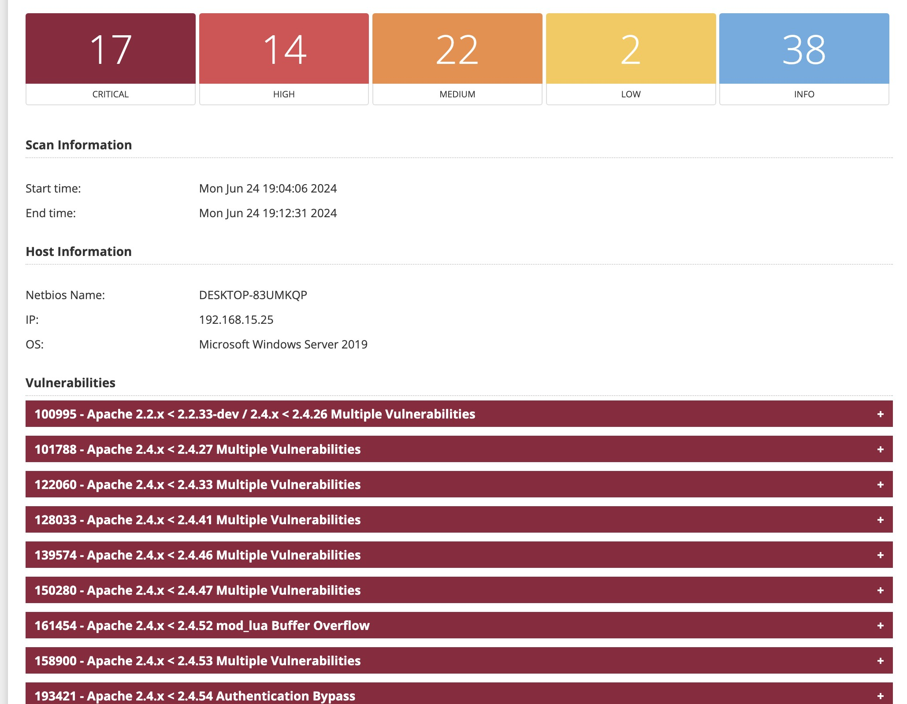

***Service***

    - Apache 443/TCP
    - เกิดกับ Apache version 2.4.x ที่มีความเสี่ยง
    - Windows เกิดกับโปรแกรม XAMPP, WAMP ที่ใช้ Apache version เก่า
    - Apache ยังไม่ได้ทำการ Config Hardening  

***Solution***
    
Upgrade Apache ให้เป็น Version ล่าสุด โดยขึ้นอยู่กับสถานการณ์หน้างานหากประเมินแล้วว่าการ Upgrade version แล้วมีความเสี่ยงกระทบกับระบบ และ Web ก็ให้เลี่ยงการ Upgrade แล้วไปทำการ Hardening

***Hardening***

**ข้อควรระวัง** สำหรับ Apache version 2.4.x ขึ้นไปเท่านั้น หากเป็น Apache version 2.2.x ให้พิจารณาเรื่องการ Upgrade apache version เนื่องจาก Apache version 2.2.x มีโอกาสไม่รองรับ TLSv1.x และไม่สามารถ Apply security ที่แนะนำได้

1. เพิ่ม config เพื่อปิดไม่ให้แสดง version ของ httpd ในไฟล์ `/etc/httpd/conf/httpd.conf`
```apache
# Hide version for security reason
ServerTokens Prod
ServerSignature Off
```

2. เพิ่ม configuration ในไฟล์ `/etc/httpd/conf.d/ssl.conf` หากในโปรแกรม XAMPP ก็ดูที่ไฟล์ `ssl.conf` หรือจะเอาไว้ที่ไฟล์ `httpd.conf` ก็ได้ หากหาไฟล์ `ssl.conf` ไม่เจอ
```apache
<IfModule mod_ssl.c>
    # HTTPS Strength Config
    SSLProtocol -All +TLSv1.2 +TLSv1.3
    SSLHonorCipherOrder on
    SSLCompression      off
    SSLSessionTickets   off
    # Disable weak ciphers
    SSLCipherSuite EECDH:EDH:!NULL:!SSLv2:!RC4:!aNULL:!3DES:!IDEA:!SHA1:!SHA256:!SHA384
</IfModule>
```
* เมื่อแก้ไข config ให้ทำการ รัน `sudo httpd -t` เพื่อทดสอบ configuration compatible ด้วย หากผิดพลาด จะได้แก้ไขก่อนได้ กรณีเป็น Windows ก็สามารถเปิด `CMD` ขึ้นมาแล้วพิมพิ์คำสั่ง `httpd -t` ได้เช่นกัน
* หากลองรันคำสั่ง `sudo httpd -t` เพื่อตรวจสอบแล้วพบว่า Protocol `TLSv1.3` ยังไม่รองรับ ก็ให้ทำการลบตรง `+TLSv1.3` ออกได้ แล้วลองใหม่อีกครั้ง

3. ทำการ Restart apache service ด้วยคำสั่ง `sudo systemctl restart httpd` หากเป็น Windows ก็ให้เปิดไปที่ `Windows service` แล้วหา service ที่ชื่อว่า `Apache` แล้วทำการ Restart

## 📑 [Critical] PHP Version เก่าเกินไป

***Service***

    - Web Service 80/TCP, 443/TCP
    - PHP

***Solution***

Upgrade ไปใช้ PHP Version ใหม่ที่มีการแก้ไข Security bugs แล้ว แต่การ Upgrade PHP Version มีความเสี่ยงสูงมากที่จะทำให้ Web Application ทำงานไม่ปกติ จึงเลี่ยงให้ไป Hardening แทน

***Hardening***

การ Hardening PHP ก็คือ การปิด Expose version ของ PHP ออกไป โดยมีขั้นตอนดังนี้
1. การแก้ไขที่ไฟล์ `/etc/php.ini` หรือหากเป็น XAMPP ก็ให้แก้ไฟล์ชื่อ `php.ini`
2. หาบรรทัดที่มีคำว่า `expose_php = On` และทำการเปลี่ยนเป็น `expose_php = Off`
3. Restart service Apache แต่หากใช้งานเป็น php-fpm ก็ให้ทำการ Restart service php-fpm 

## 📑 [Critical] 73756 - Microsoft SQL Server Unsupported Version Detection (remote check)
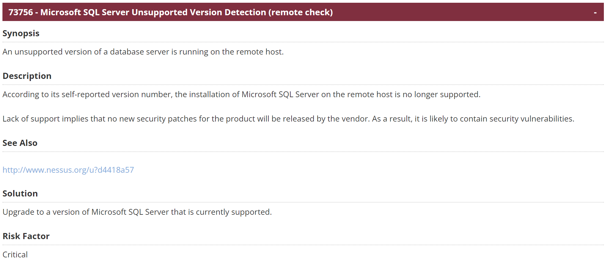

***Service***

    - MS SQL Server version น้อยกว่า 2016
    - MS SQL Express version น้อยกว่า 2016
    - tcp/1433/mssql

***Solution***

ให้แจ้ง Vendor เพื่อทำการ Upgrade version SQL ที่ใช้เป็น Version ล่าสุด หากประเมินว่าการ Upgrade version นั้นกระทบการใช้งานทำให้ระบบล่ม ก็ให้พิจารณาการทำ Hardening

***Hardening***

เปิด Windows Firewall ให้เครื่อง Server ที่ต้องใช้งานสามารถ Access เข้ามาใช้งาน SQL Server ได้เท่านั้น และปิดไม่ให้เครื่องอื่นๆ เข้ามายัง SQL Server เครื่องนี้ได้

## 📑 [High] 35291 - SSL Certificate Signed Using Weak Hashing Algorithm
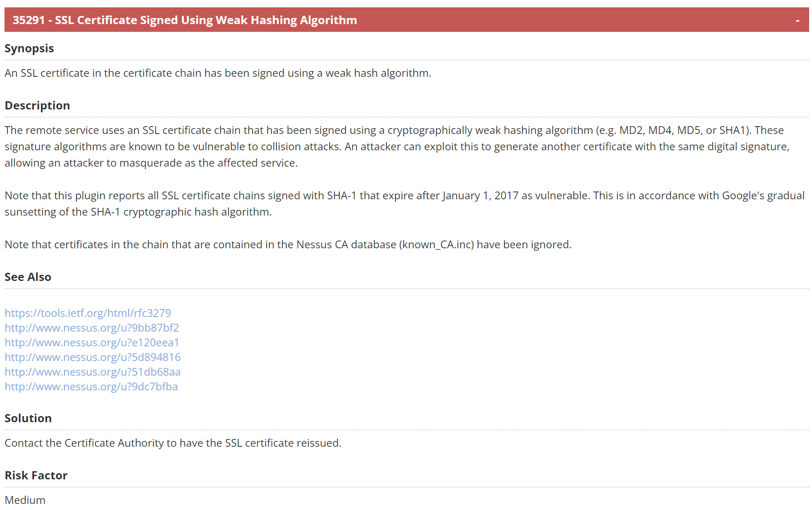

***Service***

    - Remote Desktop 3389/TCP
    - SQL Server 1433/TCP
    - IIS 443/TCP
    - HTTPAPI/2.0 443/TCP

***Solution***

ปัญหาเนื่องจาก Cert ที่ใช้งานอยู่ของ Service ใช้ `SHA1` ที่เป็น weak hash algorithm ตามคำแนะนำคือต้องใช้ `SHA256` ขึ้นไป

1. Generate Self signed cert โดยจะใช้ Program หรือผ่าน `openssl` command line ก็ได้ จากตัวอย่างจะ Convert โดยใช้ `openssl`
```bash
openssl req -x509 -newkey rsa:4096 \
 -sha256 -days 3650 -nodes \
 -keyout selfsigned.key \
 -out selfsigned.crt \
 -subj "/CN=___WINDOWS_HOSTNAME___"
```
โดยที่ชื่อ `___WINDOWS_HOSTNAME___` จะต้องเป็นชื่อของ SQL Server ถึงจะใช้งานได้

หลังจากรันคำสั่งสำเร็จจะพอไฟล์เพิ่มมา 2 ไฟล์คือ Private Key file `selfsigned.key` และ Cert file `selfsigned.crt`

2. แปลง Self signed cert ที่เป็น Format `PEM` ให้อยู่ในรูปแบบ format ของ `pfx` ที่ใช้สำหรับ Windows
```bash
openssl pkcs12 -inkey selfsigned.key -in selfsigned.crt -export -out selfsigned.pfx
```
เมื่อแปลงไฟล์สำเร็จจะพบว่ามีไฟล์ `selfsigned.pfx` เพิ่มเข้ามา

3. ทำการ Import file `selfsigned.pfx` เข้าไปใน Windows
 - ทำการกด `Win+R` เพื่อเปิด run command
 - พิมพ์ `mmc` และกด enter
 - เลือกตรง `Personal` และคลิกขวา เลือก `import`
 - เลือกไฟล์ `pfx` ที่เราได้ทำการ convert ไว้แล้วในข้อ 2

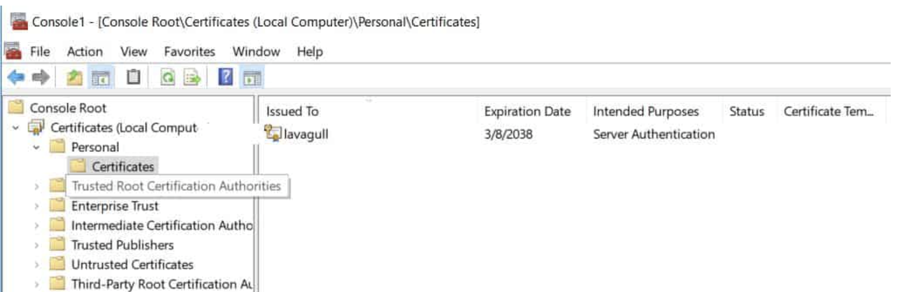

4. หากเป็น SQL Server หรือ SQL Express ให้เพิ่มสิทธิ์ให้ User ของ Service เข้ามาอ่านไฟล์ Cert โดยคลิกขวาที่ Cert ที่เรา import เข้าไปและเลือก `All Tasks` > `Manage Private Keys...`

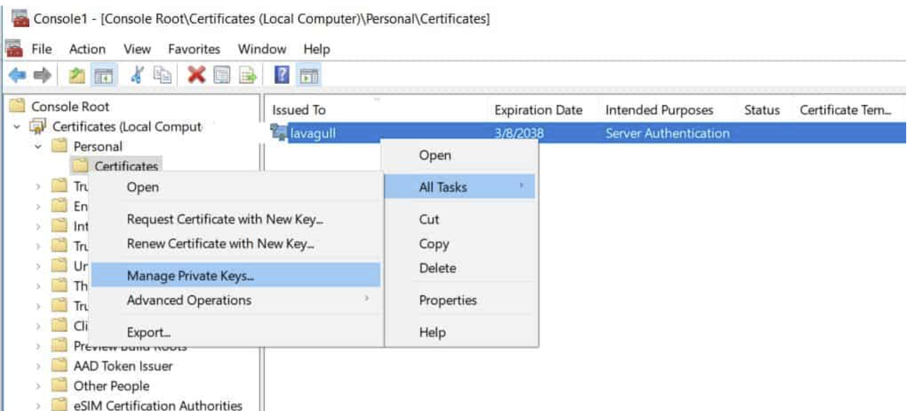
 
- SQL Server ให้เพิ่มสิทธิ์ให้ User `NT USER\MSSQLSERVER`
- SQL Express ให้เพิ่มสิทธิ์ให้ User `NETWORk SERVICE`

5. ทำการ Config Service เพื่อใช้งาน Cert ใหม่ที่ได้เพิ่ง Import เข้าไป

- SQL Serve และ SQL Express ให้ทำเหมือนกันตามขั้นตอนดังนี้
    1. เปิด `SQL Server Configuration Manager` ขึ้นมาแล้วเลือกที่ `Protocol for MSSQLSERVER` คลิกขวา และเลือก `Properties`
    
    2. เลือก tab `Certificate` และเลือก Cert ที่เราใส่เข้าไป แล้วทำการกด `OK` หลังจากนั้นทำการ Restart SQL Server และลองใช้งานอีกครั้ง
    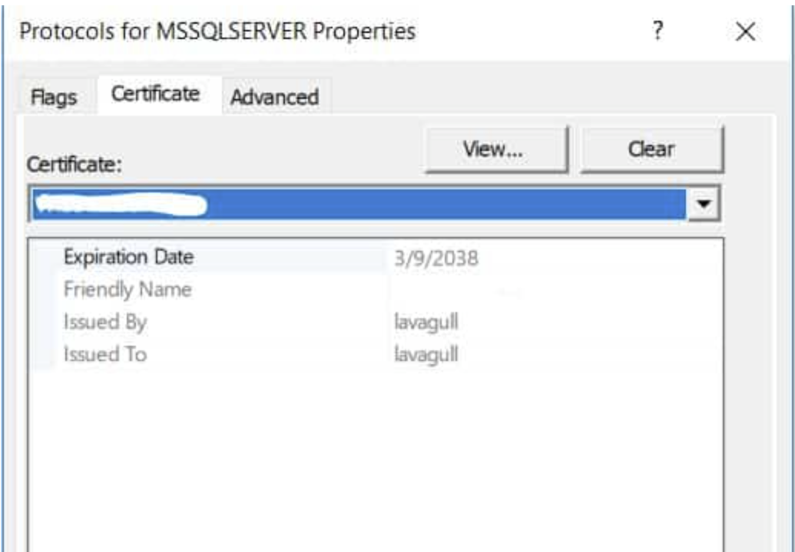
    3. เปิด Service ขึ้นมาแล้ว Restart SQL Server หรือ SQL Express แล้วทดสอบใช้งานอีกครั้ง
    *Credit: https://virtual-dba.com/blog/upgrading-sha1-certificate-sql-server/*

- Remote Desktop (3389/TCP) ให้ทำตามขั้นตอนดังนี้
    1. หาค่า FingerPrint ของ Cert ที่เราได้ Import ไปก่อนหน้านี้ โดยการ Double Click ที่ Cert
    2. เลือกไปที่ Tab `Detail` แล้วเลื่อนลงมาจนเจอคำว่า `Thumbprint` แล้ว Copy ค่าที่เจอไว้ หากค่าที่ได้มีช่องหว่า ก็ให้ลบช่องว่างออกให้เหลือดังตัวอย่าง `475da948e4ba44d9b5bc31ab4b8006113fd5f538`
    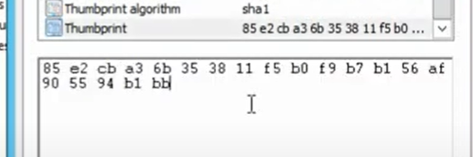
    3. เปิด notepad ขึ้นมาและเตรียมคำสั่ง `wmic /namespace:\\root\cimv2\TerminalServices PATH Win32_TSGeneralSetting Set SSLCertificateSHA1Hash="1111111111111111111111111111"` โดยนำค่า `Thumbprint` ที่ได้จากข้อ 2 มาใส่แทน `1111111111111111111111111111`
    4. เปิด PowerShell ขึ้นมา โดยให้ `Run as Administrator` แล้วนำคำสั่งที่ได้จัดเตรียมไว้ในข้อ 3 ใส่ลงไป แล้วทำการกด Enter หากผลแสดงบอกว่า `Property(s) update successful` ก็เป็นอันสำเร็จ
    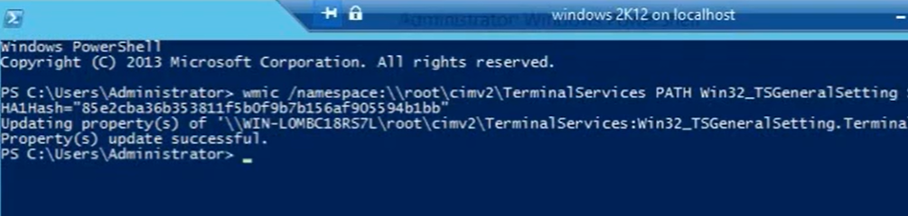

- IIS (443/TCP) ให้ทำตามขั้นตอนดังนี้ ***TODO Later***

- HTTPAPI/2.0 (443/TCP) ให้ทำตามขั้นตอนดังนี้
    1. หา FingerPrint ของ Cert ที่เราใส่เข้าไปเมื่อก่อนหน้า โดยใช้วิธีเดียวกันกับของ Remote Desktop หรือจะใช้คำสั่ง `dir cert:\localmachine\my` ใน PowerShell ก็ได้เหมือนกัน
    2. เมื่อได้ FingerPrint มาแล้วก็ให้เก็บไว้ใน notepad โดย FingerPrint จะมีลักษณะรูปแบบดังตัวอย่างนี้ `13CA91A2E446000863E10156A6748DE70885F29A`
    3. เปิด CMD ขึ้นมา โดยใช้สิทธิ์ Administrator เพื่อตรวจสอบ Service `netsh http show sslcert` จะพบ Service ที่ใช้งานอยู่ ให้ Copy ข้อมูลเหล่านี้ไว้
        - Port เช่น `0.0.0.0:443`
        - Cert Hash ของเดิม เช่น `e9d293e563cc374774bdb90007f7ef618c336f48`
        - Application ID เช่น `{85118119-e5f5-40da-b837-4acbd51d62f0}`
    4. ทำการ Delete Cert ตัวเก่าที่ใช้งานอยู่ด้วยคำสั่ง `netsh http delete sslcert ___PORT___` โดยตรง `___PORT___` นั้นให้เอา Port ที่เราได้จากข้อ 3 มาใส่ จะได้ดังตัวอย่าง `netsh http delete sslcert 0.0.0.0:443` และหาก Result ขึ้นว่า `SSL Certificate successfully deleted` ก็เป็นอันใช้ได้
    5. ทำการเพิ่ม Cert ของเราเข้าไปใน Service โดยนำข้อมูลจากข้อ 2, 4 มาใส่ จะได้ตัวอย่างคำสั่งดังนี้ `netsh http add sslcert 0.0.0.0:443 certhash=13CA91A2E446000863E10156A6748DE70885F29A appid={85118119-e5f5-40da-b837-4acbd51d62f0} certstorename=My` หากผลลัพธิ์ขึ้นว่า `SSL Certificate successfully added` ก็เป็นอันสำเร็จเรียบร้อย


## 📑 [Medium] 65821 - SSL RC4 Cipher Suites Supported (Bar Mitzvah)
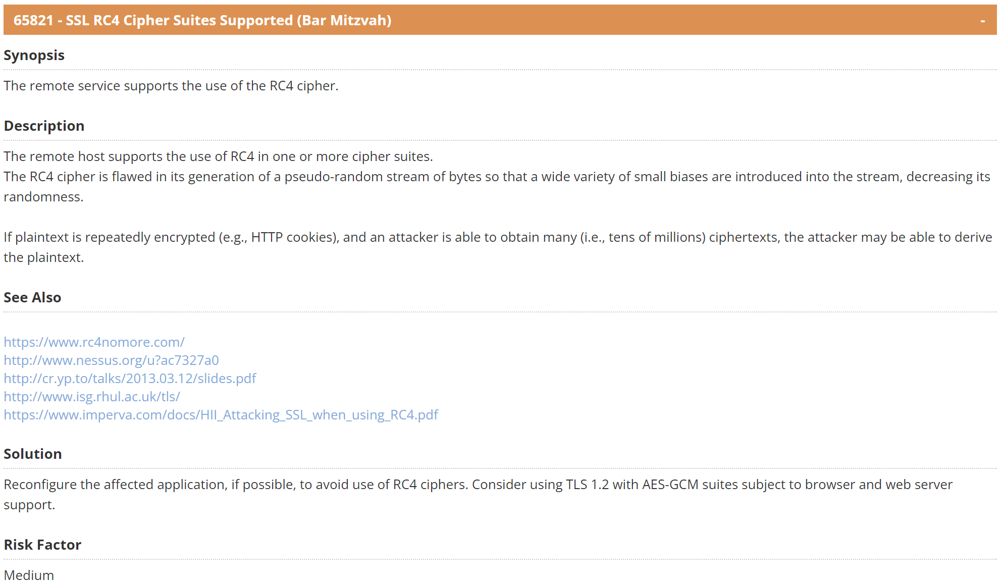

***Service***

    - Windows RDP 3389/TCP

***Solution***

    ***TODO Later***

## 📑 [Medium] 104743 - TLS Version 1.0 Protocol Detection
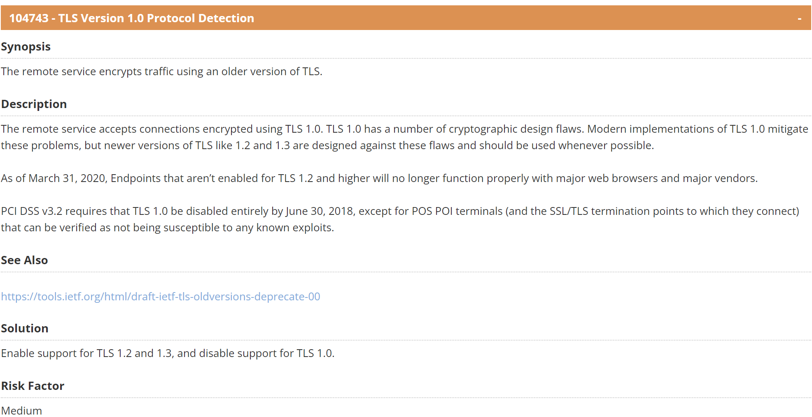

***Service***

    - Windows RDP 3389/TCP

    ***TODO Later***

## 📑 [Medium] 157288 - TLS Version 1.1 Deprecated Protocol
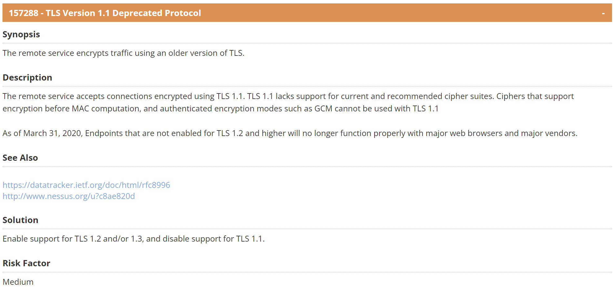

***Service***

    - Windows RDP 3389/TCP

***Solution***

    ***TODO Later***

## 📑 [Medium] 187315 - SSH Terrapin Prefix Truncation Weakness (CVE-2023-48795)
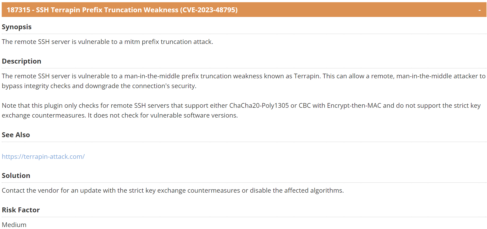

***Service***

    - Linux SSH 22/TCP

***Solution***

    ***TODO Later***

## 📑 [Low] 70658 - SSH Server CBC Mode Ciphers Enabled
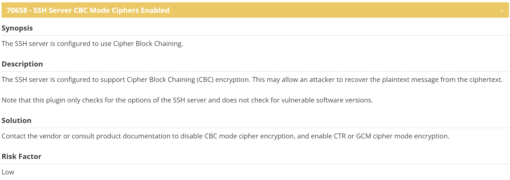

***Service***

    - Linux SSH 22/TCP

***Solution***

    ***TODO Later***

## 📑 [Low] 153953 - SSH Weak Key Exchange Algorithms Enabled
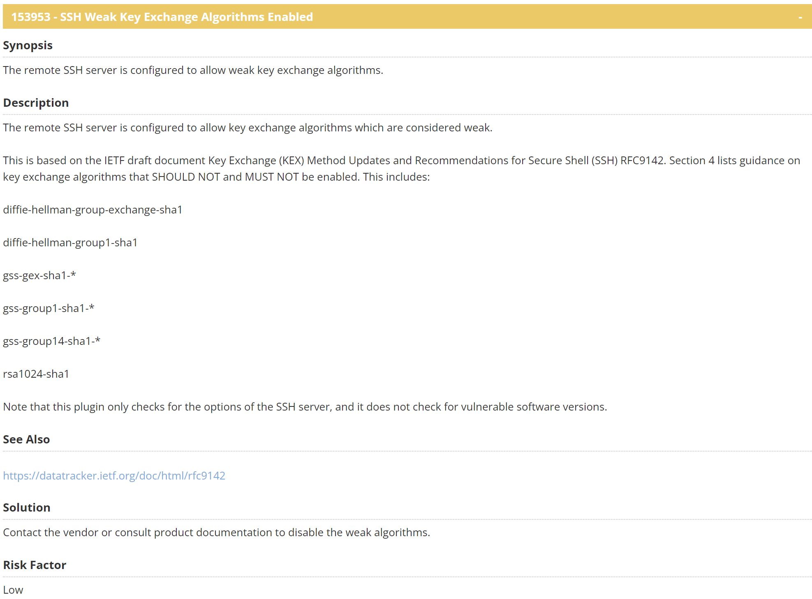

***Service***

    - Linux SSH 22/TCP

***Solution***

    ***TODO Later***

