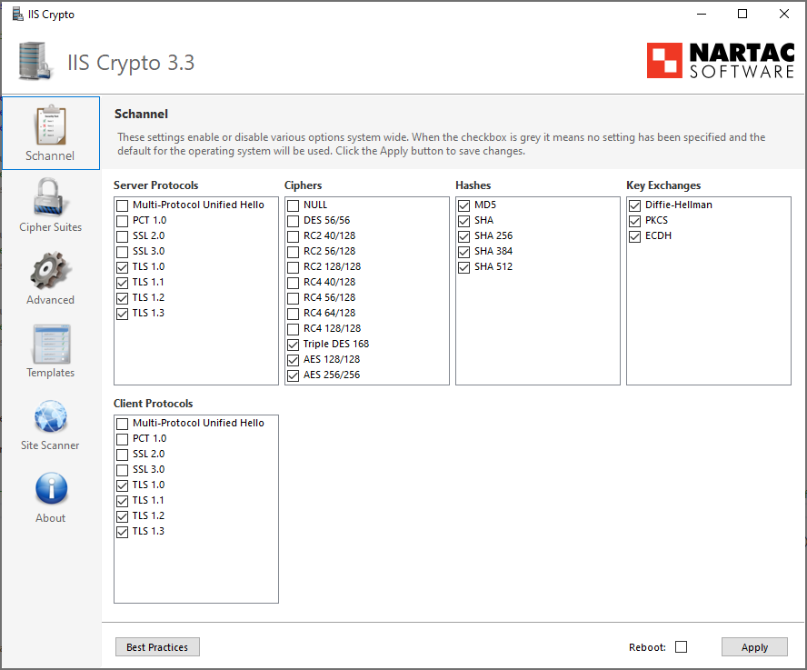

# การ Hardening Web server

## Apache / Httpd

### 📋 ปิดช่องโหว่ Apache version (httpd hardening)
เพิ่ม config เพื่อปิดไม่ให้แสดง version ของ httpd ในไฟล์ `/etc/httpd/conf.d/security.conf`
```apache
# Hide version for security reason
ServerTokens Prod
ServerSignature Off
```

### 📋 ปิดช่องโหว่ Apache CipherSuit strenght และ TLS version (Weak Cipher, SWEET32, BLEED)
เพิ่ม configuration ในไฟล์ `/etc/httpd/conf.d/security.conf`
```apache
<IfModule mod_ssl.c>
    # HTTPS Strength Config
    SSLProtocol -All +TLSv1.2 +TLSv1.3
    SSLHonorCipherOrder on
    SSLCompression      off
    SSLSessionTickets   off
    SSLCipherSuite EECDH:EDH:!NULL:!SSLv2:!RC4:!aNULL:!3DES:!IDEA:!SHA1:!SHA256:!SHA384
</IfModule>
```

### 📋 เพิ่ม Security header ของ apache เพื่อป้องกันการโจมตี XSS และ IFrame
เพิ่ม configuration ในไฟล์ `/etc/httpd/conf.d/security.conf`
```apache
# Security Header
Header always set X-Frame-Options "SAMEORIGIN"
Header always set X-XSS-Protection "1; mode=block"
Header always set X-Content-Type-Options "nosniff"
Header always set Strict-Transport-Security "max-age=31536000; includeSubDomains; preload"
```

### 📋 Enable Http/2.0 ให้กับ Apache
เพิ่ม code นี้ในไฟล์ `/etc/httpd/conf.d/security.conf`
```apache
<IfModule mod_ssl.c>
    # Enable HTTP/2
    Protocols h2 http/1.1
</IfModule>
```

## PHP ทุก Version

### 📋 ปิดช่องโหว่ของ PHP Version (php hardening)
แก้ไขไฟล์ `/etc/php.ini` เพื่อปิดไม่ให้ php แสดง version ไปผ่านหน้าเว็บ
```apache
# แก้ไข expose_php จาก On ให้เป็น Off
expose_php = Off
```

### 📋 การแก้ปัญหา Ciphersuite และ Hash algorithm ของ Windows Server, IIS, MSSQL (SWEET32)
ให้ทำการแก้ไขที่ Registry ของ OS
1. เปิด `Registry Editor` โดยใช้คำสั่ง `regedit`
2. ไปที่ `HKEY_LOCAL_MACHINE\SYSTEM\CurrentControlSet\Control\SecurityProviders\SCHANNEL\Ciphers\Triple DES 168`
3. ถ้าไม่มี key นี้ก็ให้สร้าง key โดยการ Click ขวา ที่ `SCHANNEL` เลือก `New -> Key` และตั้งชื่อว่า `Triple DES 168` 
4. สร้าง `DWORD` ที่ชื่อว่า `Enabled` และตั้งค่าเป็น `0`


หรือจะใช้วิธีการ Download program ที่ชื่อว่า IIS Crypto มาเพื่อ Config ผ่าน GUI ได้ง่ายๆ ที่ [Download](https://www.nartac.com/Products/IISCrypto/Download)

เมื่อเปิดโปรแกรมจะเจอหน้าต่างการตั้งค่า ให้กดที่ปุ่ม `Best Practices`



หลังจากให้ นั้นให้ Click เพื่อเอาหัวข้อออกดังนี้ แล้วก็ทำการ `Apply`

- Server Protocols
    - Uncheck `TLS 1.0`
    - Uncheck `TLS 1.1`

- Client Protocols
    - Uncheck `TLS 1.0`
    - Uncheck `TLS 1.1`

- Ciphers
    - Uncheck `Triple DES 168`

- Hashes
    - Uncheck `MD5`
    - Uncheck `SHA`
