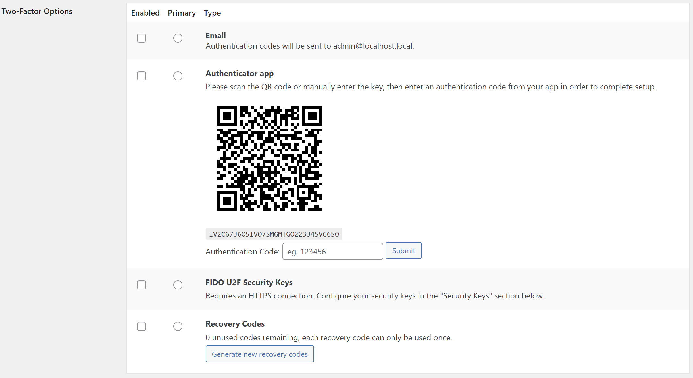
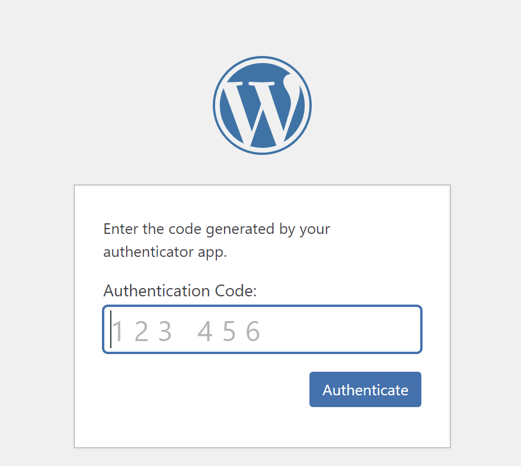
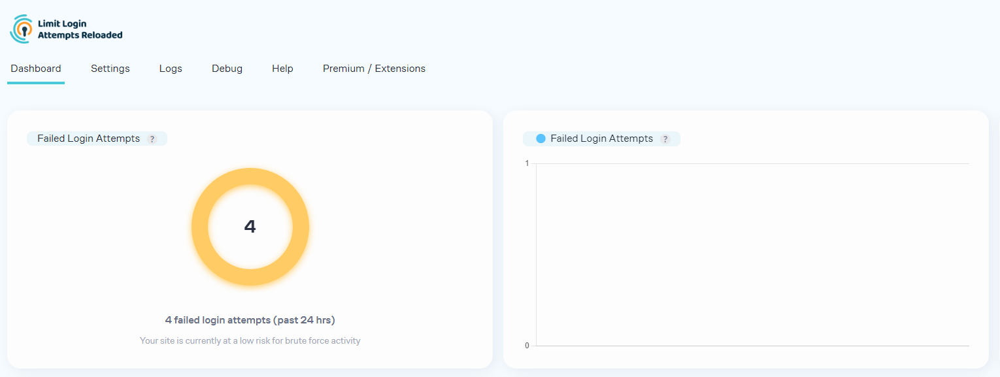
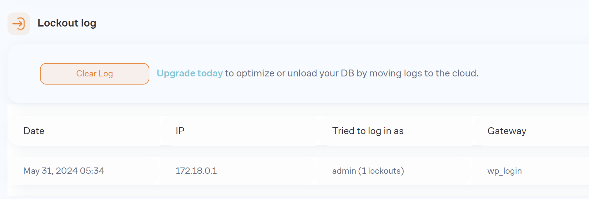
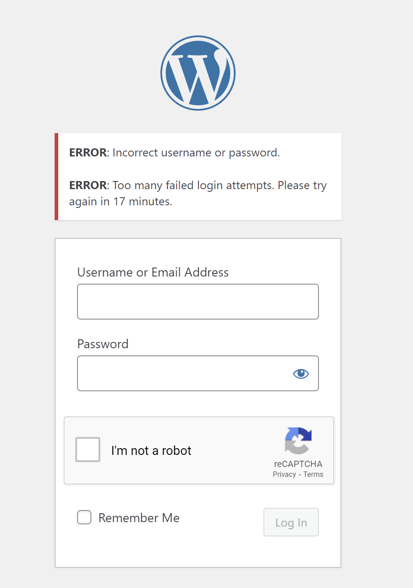
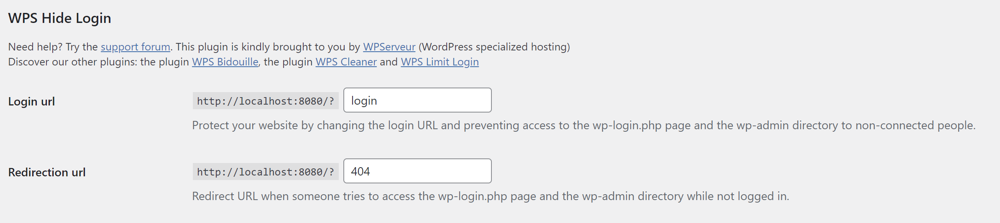
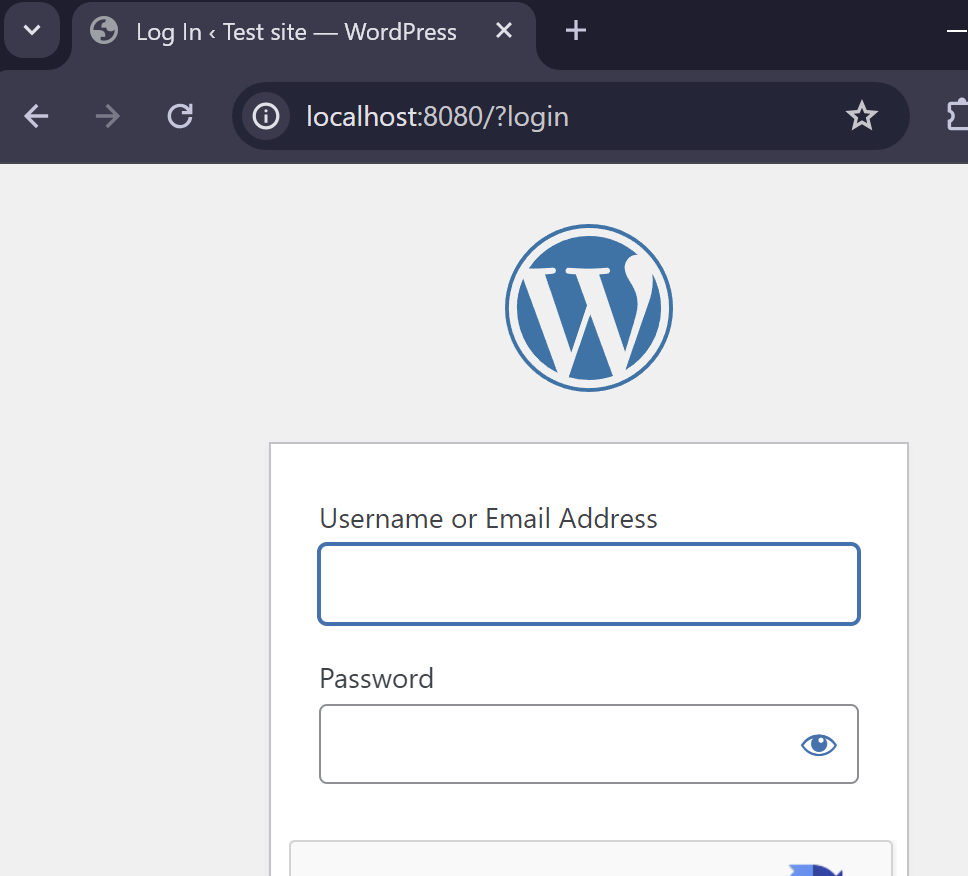
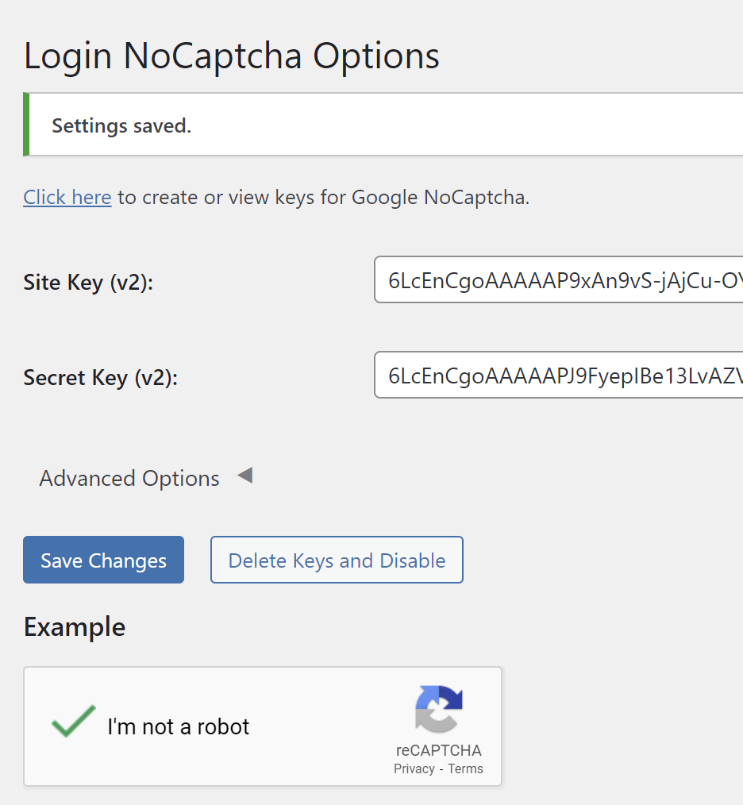
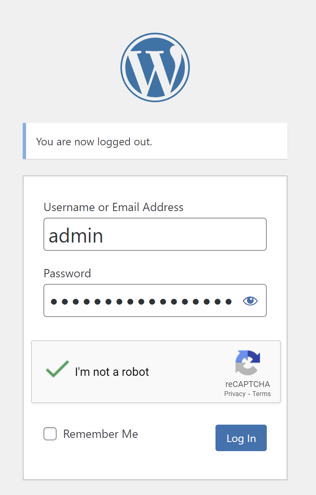
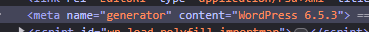

# การ Hardening Wordpress

เป็นการรวบรวมวิธีการ ปิดช่องโหว่ ที่อาจจะทำให้ระบบโดนโจมตีจากผู้ไม่หวังดี

1. แก้ไข Password สำหรับ User `Admin` ให้มีความ แข็งแรง มากพอ หรือเปลี่ยน User Admin ไปเป็นชื่ออื่นไปเลย ซึ่งสามารถดูวิธีการตั้ง Password ที่ดีได้จาก [Strong Password](../PasswordManagement/README.md)

2. Enable การใช้งาน HTTPS สำหรับ Web site [วิธีการ Enable SSL Apache](./apache-recommended-config.md)

3. Enable การใช้งาน `2Factor Authen` โดยใช้ Google Authen

ทำการ Install Plugin ที่ชื่อว่า `Two Factor` และทำการตั้งค่า 2Factor ได้จากหน้า Edit `Users` จะแสดง Multi Factor ขึ้นมาให้เราเลือกใช้ ซึ่งในที่นี้แนะนำให้ใช้ Google Authenticator



ก็ให้ทำการ Check `Enabled` และ `Primary` ที่ `Authentication app` หลังจากใช้ App `Google Authenticator` ในโทรศัพท์มา Scan แล้วก็ให้กรอก `Code` ที่ได้ใส่ในช่อง และกด Submit หากไม่มี Error ก็เป็นอันสำเร็จ



4. Enable การใช้งาน Login Attempt เพื่อจำกัดไม่ให้มีการสุ่มรหัสผ่าน เพื่อ login เข้าระบบ

ใช้ Plugin ชื่อว่า `Limit Login Attempts Reloaded` เมื่อ Install เสร็จแล้วก็ Activate ใช้ค่า Default ได้เลย โดยตัว Plugin นี้จะแสดง Dashboard ให้เราเห็นสถานะต่างๆ ได้

หน้า Dashboard


แสดง Log กรณีมีผู้พยายาม Login เข้ามาจน Block


สิ่งที่ User จะเห็นที่หน้า Login เมื่อ login ผิด



5. ซ่อนหน้า Login ไม่ให้สุ่ม หรือเดาได้ อย่างเช่น `/wp-admin` และ `/wp-login`

ใช้ Plugin ชื่อว่า `Hide WP Admin Login` เมื่อ Install และ Activate แล้วจะมี Config เพิ่มเข้ามาในหน้า Setting
เราสามารถแก้ไขเป็นค่าอื่นๆ ตามที่เราต้องการได้เลย


หลังจากตั้งค่าแล้ว path `wp-admin` และ `wp-login` จะไม่สามารถใช้งานได้ จะถูกเปลี่ยน url ใหม่ที่เราตั้งค่าไว้



6. เปิดใช้งาน reCaptCha เพื่อป้องกัน Bot Script
`Login No Captcha reCAPTCHA (Google)`

ทำการ Install Plugin ชื่อว่า `Login No Captcha reCAPTCHA (Google)` และเข้าไปที่ [Google Console](https://www.google.com/recaptcha) เพื่อลงทะเบียนขอรับ Site key, และ Secret ที่เป็น `V2 Checkbox`



เพียงเท่านี้หน้า Login ก็จะต้องให้ User Challenge `I'm not a robot` ก่อนที่จะกด Login เข้ามาได้



7. ซ่อน Wordpress version จากผู้ไม่หวังดี



เข้าไปที่แก้ไข Theme function ชื่อไฟล์ `function.php` แล้วเพิ่ม code ส่วนนี้เข้าไปเพื่อปิดไม่ให้ wordpress แสดง Version ออกมาที่ Meta
```php
remove_action('wp_head', 'wp_generator');
```

8. ป้องกันการใช้ Hotlink

เมื่อมีคนนำ Hotlink ไม่ว่าจะเป็นรูปหรือ Content ของเราไปจะกระทบกับการใช้งาน Bandwidth ของเราโดยที่ User ไม่ได้เข้ามาในเว็บของเรา ดังนั้นจึงต้องมีการป้องกันไม่ให้มีการดึงรูปไปใช้ โดยจะเพิ่มส่วนนี้เข้าไปในไฟล์ `.htaccess`
```apache
# Prevent image hotlinking in WordPress
RewriteCond %{HTTP_REFERER} !^$
RewriteCond %{HTTP_REFERER} !^http(s)?://(www\.)?yourwebsite.com [NC]
RewriteCond %{HTTP_REFERER} !^http(s)?://(www\.)?google.com [NC]
RewriteCond %{HTTP_REFERER} !^http(s)?://(www\.)?facebook.com [NC]
RewriteCond %{HTTP_REFERER} !^http(s)?://(www\.)?twitter.com [NC]
RewriteRule \.(jpg|jpeg|png|gif)$ - [F]
```

เมื่อเรา Config ใส่แล้วจะมีเพียงแค่ Web เราเอง, google, facebook, twitter เท่านั้นที่จะสามารถดึงรูปเราไปแสดงได้

ตรงนี้สามารถแก้ไข ปรับแต่งได้ตามสถานการณ์หน้างาน


9. ป้องกันการถูก DDoS โดยการปิดการใช้งาน XML RPC

เพิ่ม Config เข้าไปในไฟล์ `.htaccess`
```apache
# Disable xmlrpc
<Files xmlrpc.php>
    order deny,allow
    deny from all
</Files>
```

Cr.
- https://www.dreamhost.com/blog/secure-your-wordpress-website/
- https://www.malcare.com/blog/wordpress-hardening/
- https://blog.sucuri.net/2023/07/how-to-harden-wordpress-a-basic-overview.html
- https://themeisle.com/blog/prevent-image-hotlinking-in-wordpress
- https://patchstack.com/articles/prevent-image-hotlinking-in-wordpress/