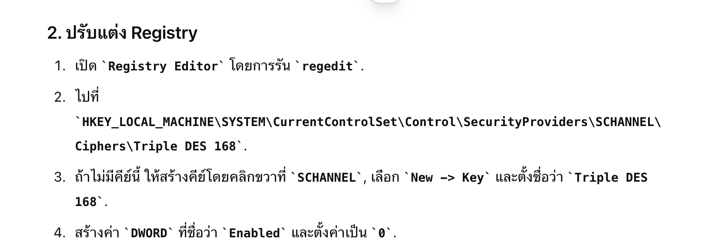
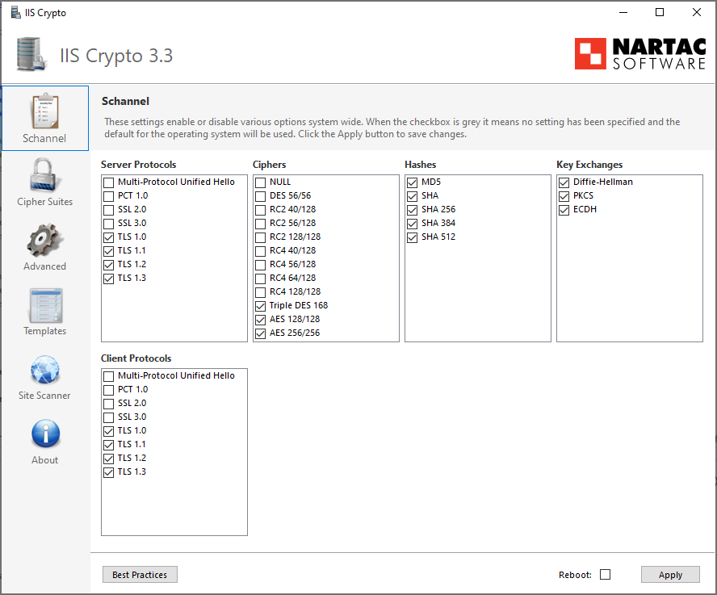

# รวบรวม KB เกี่ยวกับการแก้ไขปัญหาหน้างาน

### 📋 ไม่สามารถ Resolve name ได้
ให้ตรวจสอบไฟล์ `/etc/resolve.conf` ว่ามีสร้างไว้ หรือไม่ตั้งค่า nameserver ไว้หรือยัง หากยังก็ให้เพิ่มเข้าไปดังนี้
```
# Google DNS
nameserver 8.8.8.8
# Cloudflare DNS
nameserver 1.1.1.1
```

### 📋 Firewall Fortigate 120G Config NAT แล้วใช้งานไม่ได้
กรณีนี้จะเจอมีการเปิด Central NAT ไว้แล้ว ได้ทำการ Config NAT แล้วไม่สามารถใช้งานได้
ให้ลองเพิ่ม Source Interface ทั้ง Interface Public, Interface Private ไว้ใน Rule
ก็จะสามารถทำให้ Policy สามารถใช้งานได้


### 📋 Update AlmaLinux แล้วเจอปัญหา GPG Invalid หรือไม่ถูก สามารถ bypass ชั่วคราวได้
สามารถ Bypass gpg check ผ่านการรัน yum ในแต่ละครั้งได้โดยใช้ parameter ว่าอ `--nogpgcheck`
```
sudo yum update --nogpgcheck
```

หากต้องการปิดที่ Repository file เลยก็สามารถไปแก้ในไฟล์ repo `/etc/yum.repo.d/`

และปิดตรงหัวข้อ `gpgcheck` ให้เป็น `0` ใน repo ที่ enable ไว้


### 📋 ไม่สามารถ Update CentOS8 ได้ หรือ Update CentOS8 แล้ว ไม่สามารถ Update ได้อีก
เนื่องจาก CentOS8 หยุดการ Support ไปแล้ว ทำให้ Repository location ปิดไป ให้เข้าไป เปลี่ยนจาก
`http://mirror.centos.org` เป็น `http://vault.centos.org`

ไฟล์ที่เกี่ยวข้องจะมีด้วยกันทั้งหมด 3 files repo คือ
```
# 1 AppStream
/etc/yum.repo.d/CentOS-AppStream.repo

# 2 Base
/etc/yum.repo.d/CentOS-Base.repo

# 3 Extra
/etc/yum.repo.d/CentOS-Extra.repo
```

### 📋 Recommend Apache2 configuration
[Config](WebServer/apache-recommended-config.md)

### 📋 การติดตั้ง XAMP บน AlmaLinux
[XAMP](WebServer/install-xamp-alma9.md)

### การติดตั้ง NGINX 1.26.0
[NGINX 1.26.0](WebServer/nginx-1.26-install.md)

### 📋 ปิดช่องโหว่ Apache version (httpd hardening)
เพิ่ม config เพื่อปิดไม่ให้แสดง version ของ httpd ในไฟล์ `/etc/httpd/conf/httpd.conf`
```
# Hide version for security reason
ServerTokens Prod
ServerSignature Off
```

### 📋 ปิดช่องโหว่ของ PHP Version (php hardening)
แก้ไขไฟล์ `/etc/php.ini` เพื่อปิดไม่ให้ php แสดง version ไปผ่านหน้าเว็บ
```
# แก้ไข expose_php จาก On ให้เป็น Off
expose_php = Off
```

### 📋 ปิดช่องโหว่ Apache CipherSuit strenght และ TLS version (Weak Cipher, SWEET32, BLEED)
เพิ่ม configuration ในไฟล์ `/etc/httpd/conf/httpd.conf`
```
# HTTPS Strength Config
SSLProtocol -All +TLSv1.2 +TLSv1.3
SSLHonorCipherOrder on
SSLCompression      off
SSLSessionTickets   off
SSLCipherSuite EECDH:EDH:!NULL:!SSLv2:!RC4:!aNULL:!3DES:!IDEA:!SHA1:!SHA256:!SHA384
```

### 📋 เพิ่ม Security header ของ apache เพื่อป้องกันการโจมตี XSS และ IFrame
เพิ่ม configuration ในไฟล์ `/etc/httpd/conf/httpd.conf`
```
# Security Header
Header always set X-Frame-Options "SAMEORIGIN"
Header always set X-XSS-Protection "1; mode=block"
Header always set X-Content-Type-Options "nosniff"
Header always set Strict-Transport-Security "max-age=31536000; includeSubDomains; preload"
```

### 📋 Enable Http/2.0 ให้กับ Apache
เพิ่ม code นี้ในไฟล์ `/etc/httpd/conf/httpd.conf`
```
# Enable HTTP/2
Protocols h2 http/1.1
```

### 📋 คำสั่งสำหรับ update os linux
- สำหรับ Ubuntu, Debian
```
sudo apt update
sudo apt upgrade -y
```

- สำหรับ CentOS, AlmaLinux, RockyLinux
```
sudo yum update -y

# สำหรับ update เฉพาะ Security patch update
sudo yum udpate --security -y
```

### 📋 คำสั่งสำหรับตรวจสอบ Port ที่เปิดไว้ในเครื่อง และ Process ที่ใช้ Port นั้นอยู่
```
sudo netstat -lnp
```

### 📋 คำสั่งสำหรับตรวจสอบ Interface ของเครื่อง Linux
```
sudo ifconfig
```
*หากไม่สามารถใช้งานได้ ให้ลอง Install `sudo yum install net-tools` หรือถ้าใช้ Ubuntu ก็ใช้คำสั่ง `sudo apt install net-tools`

### 📋 Web สำหรับตรวจสอบ HTTPS และ Security ต่างๆ ที่น่าสนใจ
- [SSL LAB](https://www.ssllabs.com/ssltest/) ควรจะต้องอยู่ในระดับ A ขึ้นไป
- [Security Header](https://securityheaders.com/) ควรต้องอยู่ในระดับ A ขึ้น (หากเป็นไปได้)

### 📋 การแก้ปัญหา Ciphersuite และ Hash algorithm ของ Windows Server, IIS, MSSQL (SWEET32)
ให้ทำการแก้ไขที่ Registry ของ OS
1. เปิด `Registry Editor` โดยใช้คำสั่ง `regedit`
2. ไปที่ `HKEY_LOCAL_MACHINE\SYSTEM\CurrentControlSet\Control\SecurityProviders\SCHANNEL\Ciphers\Triple DES 168`
3. ถ้าไม่มี key นี้ก็ให้สร้าง key โดยการ Click ขวา ที่ `SCHANNEL` เลือก `New -> Key` และตั้งชื่อว่า `Triple DES 168` 
4. สร้าง `DWORD` ที่ชื่อว่า `Enabled` และตั้งค่าเป็น `0`



หรือจะใช้วิธีการ Download program ที่ชื่อว่า IIS Crypto มาเพื่อ Config ผ่าน GUI ได้ง่ายๆ ที่ [Download](https://www.nartac.com/Products/IISCrypto/Download)

เมื่อเปิดโปรแกรมจะเจอหน้าต่างการตั้งค่า ให้กดที่ปุ่ม `Best Practices`



หลังจากให้ นั้นให้ Click เพื่อเอาหัวข้อออกดังนี้ แล้วก็ทำการ `Apply`

- Server Protocols
    - Uncheck `TLS 1.0`
    - Uncheck `TLS 1.1`

- Client Protocols
    - Uncheck `TLS 1.0`
    - Uncheck `TLS 1.1`

- Ciphers
    - Uncheck `Triple DES 168`

- Hashes
    - Uncheck `MD5`
    - Uncheck `SHA`