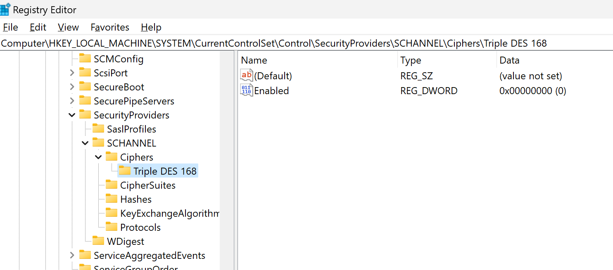
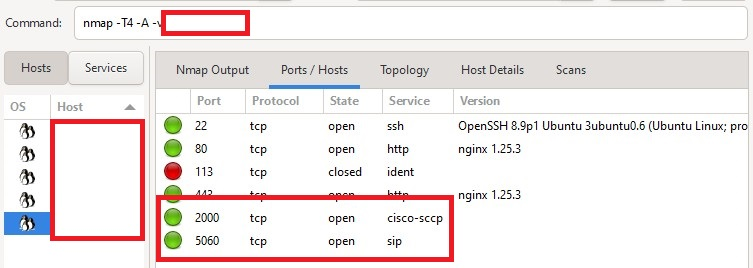
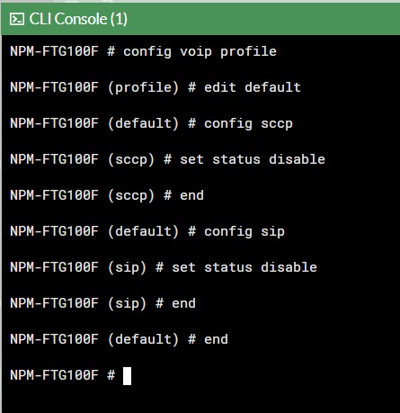
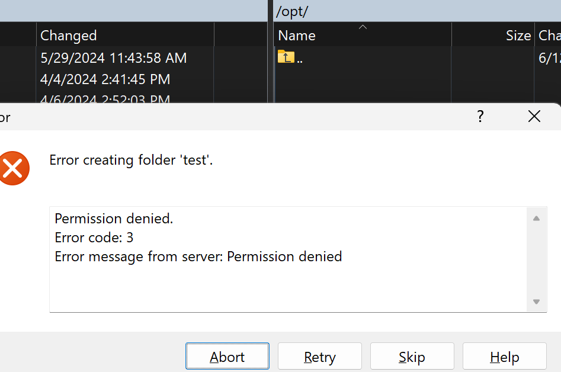
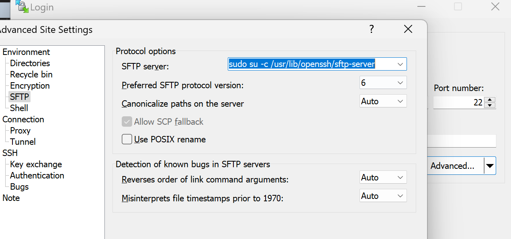
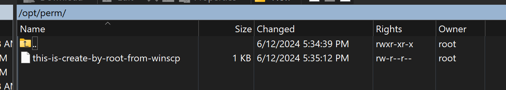
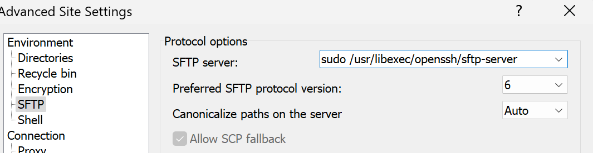
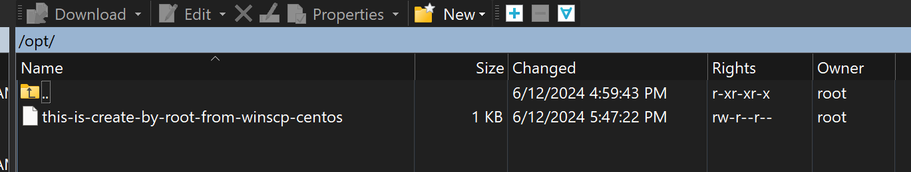
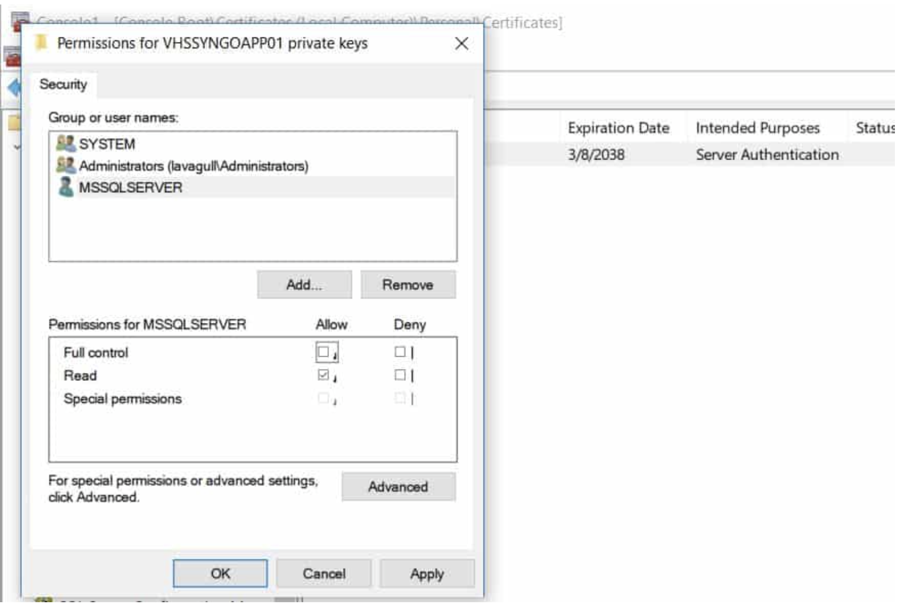

# รวบรวม KB เกี่ยวกับการแก้ไขปัญหาหน้างาน

### 📋 ไม่สามารถ Resolve name ได้
ให้ตรวจสอบไฟล์ `/etc/resolve.conf` ว่ามีสร้างไว้ หรือไม่ตั้งค่า nameserver ไว้หรือยัง หากยังก็ให้เพิ่มเข้าไปดังนี้
```conf
# Google DNS
nameserver 8.8.8.8
# Cloudflare DNS
nameserver 1.1.1.1
```

### 📋 คำสั่งสำหรับ GUI Network Management ของ AlmaLinux 
สำหรับตั้งค่า Network ไม่ว่าจะเป็น IP, DNS, Routing ของ OS
```bash
sudo nmtui
```

### 📋 Firewall Fortigate 120G Config NAT แล้วใช้งานไม่ได้
กรณีนี้จะเจอมีการเปิด Central NAT ไว้แล้ว ได้ทำการ Config NAT แล้วไม่สามารถใช้งานได้
ให้ลองเพิ่ม Source Interface ทั้ง Interface Public, Interface Private ไว้ใน Rule
ก็จะสามารถทำให้ Policy สามารถใช้งานได้


### 📋 Update AlmaLinux แล้วเจอปัญหา GPG Invalid หรือไม่ถูก สามารถ bypass ชั่วคราวได้
สามารถ Bypass gpg check ผ่านการรัน yum ในแต่ละครั้งได้โดยใช้ parameter ว่าอ `--nogpgcheck`
```bash
sudo yum update --nogpgcheck
```

หากต้องการปิดที่ Repository file เลยก็สามารถไปแก้ในไฟล์ repo `/etc/yum.repo.d/`

และปิดตรงหัวข้อ `gpgcheck` ให้เป็น `0` ใน repo ที่ enable ไว้


### 📋 ไม่สามารถ Update CentOS8 ได้ หรือ Update CentOS8 แล้ว ไม่สามารถ Update ได้อีก
เนื่องจาก CentOS8 หยุดการ Support ไปแล้ว ทำให้ Repository location ปิดไป ให้เข้าไป เปลี่ยนจาก
`http://mirror.centos.org` เป็น `http://vault.centos.org`

* ใน repo มีใช้งาน mirrorlist ให้ปิด mirrorlist แล้วเปิดใช้งาน baseUrl แทนด้วย

ไฟล์ที่เกี่ยวข้องจะมีด้วยกันทั้งหมด 3 files repo คือ
```
# 1 AppStream
/etc/yum.repo.d/CentOS-AppStream.repo

# 2 Base
/etc/yum.repo.d/CentOS-Base.repo

# 3 Extra
/etc/yum.repo.d/CentOS-Extra.repo
```

### 📋 Recommend Apache2 configuration
[Config](./WebServer/apache-recommended-config.md)

### 📋 การติดตั้ง XAMP บน AlmaLinux
[XAMP](./WebServer/install-xamp-alma9.md)

### การติดตั้ง NGINX 1.26.0
[NGINX 1.26.0](./WebServer/nginx-1.26-install.md)

### 📋 ปิดช่องโหว่ Apache version (httpd hardening) โดน VA พวกช่องโหว่ Apache CVE หลายๆ ตัว
เพิ่ม config เพื่อปิดไม่ให้แสดง version ของ httpd ในไฟล์ `/etc/httpd/conf/httpd.conf`
```apache
# Hide version for security reason
ServerTokens Prod
ServerSignature Off
```

### 📋 ปิดช่องโหว่ของ PHP Version (php hardening) โดน VA เจอช่องโหว่ PHP Version เก่า
แก้ไขไฟล์ `/etc/php.ini` เพื่อปิดไม่ให้ php แสดง version ไปผ่านหน้าเว็บ
```apache
# แก้ไข expose_php จาก On ให้เป็น Off
expose_php = Off
```

### 📋 ปิดช่องโหว่ Apache CipherSuit strenght และ TLS version (Weak Cipher, SWEET32, BLEED)
เพิ่ม configuration ในไฟล์ `/etc/httpd/conf.d/ssl.conf`
```apache
<IfModule mod_ssl.c>
    # HTTPS Strength Config
    SSLProtocol -All +TLSv1.2 +TLSv1.3
    SSLHonorCipherOrder on
    SSLCompression      off
    SSLSessionTickets   off
    SSLCipherSuite EECDH:EDH:!NULL:!SSLv2:!RC4:!aNULL:!3DES:!IDEA:!SHA1:!SHA256:!SHA384
</IfModule>
```
* พิจารณา Version ของ Apache ด้วย หาก Apache version 2.2 จะไม่รองรับ TLSv1.x และอาจจะ Error ได้ แนะนำให้ใช้ Apache version 2.4 ขึ้นไป
* เมื่อแก้ไข config ให้ทำการ รัน `sudo httpd -t` เพื่อทดสอบ configuration compatible ด้วย หากผิดพลาด จะได้แก้ไขก่อนได้

### 📋 เพิ่ม Security header ของ apache เพื่อป้องกันการโจมตี XSS และ IFrame
เพิ่ม configuration ในไฟล์ `/etc/httpd/conf/httpd.conf`
```apache
# Security Header
Header always set X-Frame-Options "SAMEORIGIN"
Header always set X-XSS-Protection "1; mode=block"
Header always set X-Content-Type-Options "nosniff"
Header always set Strict-Transport-Security "max-age=31536000; includeSubDomains; preload"
```

### 📋 Enable Http/2.0 ให้กับ Apache
เพิ่ม code นี้ในไฟล์ `/etc/httpd/conf.d/ssl.conf`
```apache
<IfModule mod_ssl.c>
    # Enable HTTP/2
    Protocols h2 http/1.1
</IfModule>
```

### 📋 คำสั่งสำหรับ update os linux
- สำหรับ Ubuntu, Debian
```bash
sudo apt update
sudo apt upgrade -y

# Ubuntu ไม่มีคำสั่ง upgrade เฉพาะ Security แต่สามารถตรวจสอบดูได้ว่ามี Security package ที่มีให้อัพเดทไหมได้โดย
# 1. Refresh update list
sudo apt update
# 2. Show security update list
sudo apt list --upgradable 2>/dev/null | grep "\-security"
# 3. Install security update list
sudo apt list --upgradable 2>/dev/null | grep "\-security" | awk -F " " {'print $1'} | awk -F "," {'print $1'} | sudo xargs apt install --only-upgrade -y

# กรุณาใช้คำสั่งอย่างระมัดระวัง
```

- สำหรับ CentOS, AlmaLinux, RockyLinux
```bash
sudo yum update -y

# สำหรับ update เฉพาะ Security patch update
sudo yum udpate --security -y
```

### 📋 คำสั่งสำหรับตรวจสอบ Port ที่เปิดไว้ในเครื่อง และ Process ที่ใช้ Port นั้นอยู่
```bash
sudo netstat -lnp
```

### 📋 คำสั่งสำหรับตรวจสอบ Interface ของเครื่อง Linux
```bash
sudo ifconfig
```
*หากไม่สามารถใช้งานได้ ให้ลอง Install `sudo yum install net-tools` หรือถ้าใช้ Ubuntu ก็ใช้คำสั่ง `sudo apt install net-tools`

### 📋 คำสั่ง Linux สำหรับ Sniff packet
```bash
# ใช้คำสั่ง tcpdump โดยจะมี parameter ที่ใช้งานดังนี้
# 1. เลือก Interface
# -i <interface>
#
# 2. ไม่ต้อง Resovle name n 1 ตัว = ไม่ resolve ip, n 2 ตัวไม่ต้อง resolve port
# -nnn
#
# 3. Filter protocol เช่น
# tcp
#
# 4. Filter port เช่น
# port 443
#
# 5. Filter ip
# host 192.168.1.1
# src 192.168.1.1
# dst 192.168.1.1

# Example #1
# ต้องการ Sniff ดูว่า มีการเรียกใช้งาน Web HTTP จาก IP 10.0.1.20 เข้ามาที่ Server ที่ Interface eth0 หรือไม่ ก็จะรันคำสั่งแบบนี้
sudo tcpdump -i eth0 -nnn tcp port 80 and src 10.0.1.20

# Example #2
# ต้องการ Sniff ดูว่ามีการเรียกใช้งานจากเครื่อง Server ออกไปยัง DNS ปลายทางที่เป็น 8.8.8.8 หรือผ่าน Interface ens192 หรือไม่
sudo tcpdump -i ens192 -nnn udp port 53 and dst 8.8.8.8

# Example #3
# ต้องการ Sniff ดูว่ามี packet เข้าออกจาก Server ไปหา IP 192.168.1.30 ผ่าน Interface eth1 หรือไม่
sudo tcpdump -i eth1 -nnn host 192.168.1.30
```

### 📋 Web สำหรับตรวจสอบ HTTPS และ Security ต่างๆ ที่น่าสนใจ
- [SSL LAB](https://www.ssllabs.com/ssltest/) ควรจะต้องอยู่ในระดับ A ขึ้นไป
- [Security Header](https://securityheaders.com/) ควรต้องอยู่ในระดับ A ขึ้น (หากเป็นไปได้)

### 📋 การแก้ปัญหา Ciphersuite และ Hash algorithm ของ Windows Server, IIS, MSSQL (SWEET32)
ให้ทำการแก้ไขที่ Registry ของ OS
1. เปิด `Registry Editor` โดยใช้คำสั่ง `regedit`
2. ไปที่ `HKEY_LOCAL_MACHINE\SYSTEM\CurrentControlSet\Control\SecurityProviders\SCHANNEL\Ciphers\Triple DES 168`
3. ถ้าไม่มี key นี้ก็ให้สร้าง key โดยการ Click ขวา ที่ `Ciphers` เลือก `New -> Key` และตั้งชื่อว่า `Triple DES 168` 
4. สร้าง `DWORD` ที่ชื่อว่า `Enabled` และตั้งค่าเป็น `0`



<!--  -->

หรือจะใช้วิธีการ Download program ที่ชื่อว่า IIS Crypto มาเพื่อ Config ผ่าน GUI ได้ง่ายๆ ที่ [Download](https://www.nartac.com/Products/IISCrypto/Download)

เมื่อเปิดโปรแกรมจะเจอหน้าต่างการตั้งค่า ให้กดที่ปุ่ม `Best Practices`


หลังจากให้ นั้นให้ Click เพื่อเอาหัวข้อออกดังนี้ แล้วก็ทำการ `Apply`

- Server Protocols
    - Uncheck `TLS 1.0`
    - Uncheck `TLS 1.1`

- Client Protocols
    - Uncheck `TLS 1.0`
    - Uncheck `TLS 1.1`

- Ciphers
    - Uncheck `Triple DES 168`

- Hashes
    - Uncheck `MD5`
    - Uncheck `SHA`


### 📋 Import OVA CentOS7 จาก VirtualBox เข้า Promox แล้ว Boot ไม่ได้ติดที่หน้า Dracut
ในตอน Boot ที่หน้า Grub ให้เลือก Boot อันท้ายสุดที่จะมีคำว่า `Rescue` เพื่อเข้าสู่ระบบ

หลังจาก Boot เข้ามา แล้วก็ให้เปิด Terminal แล้วเพิ่มคำสั่ง เพื่อ regenerate dracut ใหม่

```bash
sudo dracut --regenerate-all --force
```

แล้วจึงทำการ Reboot หลังจากนั้นก็จะกลับมาใช้งานได้ปกติ

Cr. https://forums.centos.org/viewtopic.php?t=63988&start=10

### 📋 การ Convert File Cert PEM ให้เป็น Format สำหรับใช้ใน Windows (.pfx)

สิ่งที่ต้องใช้
1. ไฟล์ Cert เช่น abc.crt
2. ไฟล์ Key เช่น key.pem
3. CA Intermediate Cert ไฟล์ ca.crt
4. รหัสผ่านสำหรับใส่ไว้ในไฟล์ pfx

รูปแบบคำสั่งที่ใช้ Convert ก็จะเป็นดังนี้ เป็นการ Conert จาก pem เป็น pkcs12
```bash
# Convert pem to pfx
openssl pkcs12 -inkey <private_key_file> -in <cert_file> -certfile <ca_cert_file> -export -out <output_pfx_file>
```

ตัวอย่างการรันคำสั่งจากข้อมูลข้างต้น
```bash
openssl pkcs12 -inkey abc.pem -in abc.crt -certfile ca.crt -export -out abc.pfx
```
เมื่อรันคำสั่ง ระบบจะให้เราใส่ Password สำหรับ pfx ไฟล์ และจะได้ไฟล์ output ชื่อ `abc.pfx` มา

ให้นำไฟล์นี้ `abc.pfx` ไป import ใน IIS บน Windows และใช้ Password ที่เราใส่ตอน Convert มา
ก็จะสามารถใช้งาน Cert ได้

Cr. https://www.sslshopper.com/ssl-converter.html

### 📋 กรณีใช้ NMAP scan แล้วเจอ port TCP/2000 หรือ TCP/5060 ที่ Firewall Fortigate

ตัวอย่างที่ Scan เจอ จะพบ 2 ports ดังนี้



หากไม่ได้มีการใช้งาน SIP และ Cisco CSSP
ให้ทำการ ปิด ที่ Firewall โดยใช้ Command line ดังนี้ได้เลย




### 📋 กรณีต้องการให้ Apache Allow `path` ให้เข้าได้เฉพาะบาง IP เท่านั้น

สามารถเพิ่มได้ 2 ที่ทั้ง Config ที่ vhost หรือที่ .htaccess ของ url นั้นได้ โดยการเพิ่ม config ลงไปดังนี้

```apache
<Location "/location/">  
    AllowOverride None  
    Order Deny,Allow  
    Deny from All
    # รายการ Allow IP ที่ต้องการ
    Allow from 10.10.10.10
    Allow from 10.10.1.0/24
</Location>

<Location "/location/sub">  
    Allow from All
</Location>
```

### 📋 ใช้โปรแกรม WinSCP เพื่อ Upload files โดยใช้สิทธิ์ root

กรณีเมื่อเรา Enable PAM และปิด user `root` แล้ว ทีม Dev จากเดิมที่เคยใช้ Program WinSCP Upload file เว็บ ก็จะไม่สามารถ Upload โดยใช้ User ของตัวเองไปที่ Dir ปลายทางได้เหมือนเดิม เพราะติดเรื่อง Permission ของ Files และ Dir



ในกรณีนี้เราแก้ปัญหาด้วยการ ตั้งค่า WinSCP เพิ่มเติมเพื่อให้สามารถ Upload file ไปยัง Dir ปลายทางโดยใช้สิทธิ์ `root` ได้โดยไม่ต้อง Upload ไปที่ Home แล้ว SSH เข้าไป ย้าย File ไป Dir ปลายทาง หรือ เปลี่ยนสิทธิ์ของไฟล์แบบ 777 ซึ่งเป็นวิธีที่ไม่แนะนำ

***หมายเหตุ*** กรณีนี้ user จะต้องอยู่ใน group `sudo` ใน ubuntu หรือ group `wheel` ใน centos, almalinux หรือ group ที่สามารถใช้คำสั่ง `sudo` ได้เท่านั้น !!!

#### วิธีการตั้งค่าจะแตกต่างกันโดยแบ่งออกเป็น 2 กลุ่มคือ 
- Debian, Ubuntu
กรณีที่เป็น Debian จะง่ายหน่อย โดย
1. ตอนตั้งค่า Connection ให้เข้าไปที่ `Advance > SFTP` แล้วก็เอา Command ด้านล่างไปใส่ในช่อตามรูป
```
sudo su -c /usr/lib/openssh/sftp-server
```


2. หลังจากนั้นก็ Connect ไปตามปกติ ก็จะสามารถใช้สิทธิ์ `root` ในการ Upload files ได้แล้ว โดยเมื่อเราสร้างไฟล์ หรือ Upload file จะเห็นว่า Owner เป็น `root`



- CentOS, AlamaLinux
กรณีที่เป็นสาย Red Hat จะมีขั้นตอนเพิ่มเติมนิดหน่อย คือ ต้องได้ทำการเพิ่มสิทธิ์ในการ Execute คำสั่ง SFTP Server โดยไม่ต้องมี Password ซึ่งเราจะเปิดให้เฉพาะ Group `Wheel` เท่านั้ และเฉพาะคำสั่งเดียว

1. ทำการ SSH เข้าไปยังเครื่อง Server ปลายทาง และเพิ่มบรรทัดนี้ลงไปที่ตอนท้ายของไฟล์ `sudo vi /etc/sudoers`

```
# Allow sudo with WinSCP
%wheel ALL=NOPASSWD:/usr/libexec/openssh/sftp-server
```

หลังจากเสร็จแล้วก็ Exit ออกจากเครื่อง Server ได้

2. เปิดโปรแกรม WinSCP สร้าง Connection ไปที่ `Advance > SFTP` เหมือนกันกับของ Ubuntu แต่เปลี่ยนเอา Command นี้ไปใส่ในช่อง SFTP server

```
sudo /usr/libexec/openssh/sftp-server
```



3. ทำการ Connect และใช้งานตามปกติได้เลย โดยไฟล์ที่ถูก upload ขึ้นไป หรือสร้าง ก็จะมี Owner เป็น `root` และสามารถ upload file ขึ้นไปยัง server โดยใช้สิทธิ์ `root` ได้แล้ว



### 📋 วิธีตรวจสอบ CPU Process บน Firewall Fortigate หากเจอ High CPU Usage

* เจอปัญหา CPU สูงหลังจาก `enable send syslog` สำหรับ Firewall `Fortigate 61E v6.0.5` แนะนำให้ Upgrade ไป `v6.4.8` หรือสูงกว่า (Note. ได้ทดสอบ `v7.2.8` แล้วไม่เจอปัญหา CPU สูงหลัง enable send syslog)

ทำการ Diag ดู Process
``` bash
# Show top processes information
diagnose sys top

# Show top threads information
diagnose sys top-all
```

หากพบ Process ผิดปกติ ให้ลองเช็คตามนี้
- miglogd => เกี่ยวกับการส่ง syslog ลองไล่ดู Configuration ที่ Log setting หรือลองปิด Send syslog ดูว่า CPU ลดลงไหม
- ips => เกี่ยวกับ UTM ใน Policy อาาจะต้องลองปิดใช้งาน IPS ในบาง Policy

### 📋 แก้ Cert MSSQL Weak self signed use SHA1 hash

ปัญหาเนื่องจาก Cert ที่ใช้งานอยู่ของ MSSQLSERVER ใช้ `SHA1` ที่เป็น weak hash algorithm ตามคำแนะนำคือต้องใช้ `SHA256` ขึ้นไป

1. Generate Self signed cert โดยจะใช้ Program หรือผ่าน `openssl` command line ก็ได้ จากตัวอย่างจะ Convert โดยใช้ `openssl`
```bash
openssl req -x509 -newkey rsa:4096 \
 -sha256 -days 3650 -nodes \
 -keyout selfsigned.key \
 -out selfsigned.crt \
 -subj "/CN=___WINDOWS_HOSTNAME___"
```
โดยที่ชื่อ `___WINDOWS_HOSTNAME___` จะต้องเป็นชื่อของ SQL Server ถึงจะใช้งานได้

หลังจากรันคำสั่งสำเร็จจะพอไฟล์เพิ่มมา 2 ไฟล์คือ Private Key file `selfsigned.key` และ Cert file `selfsigned.crt`

2. แปลง Self signed cert ที่เป็น Format `PEM` ให้อยู่ในรูปแบบ format ของ `pfx` ที่ใช้สำหรับ Windows
```bash
openssl pkcs12 -inkey selfsigned.key -in selfsigned.crt -export -out selfsigned.pfx
```
เมื่อแปลงไฟล์สำเร็จจะพบว่ามีไฟล์ `selfsigned.pfx` เพิ่มเข้ามา

3. ทำการ Import file `selfsigned.pfx` เข้าไปใน Windows
 - ทำการกด `Win+R` เพื่อเปิด run command
 - พิมพ์ `mmc` และกด enter
 - เลือกตรง `Personal` และคลิกขวา เลือก `import`
 - เลือกไฟล์ `pfx` ที่เราได้ทำการ convert ไว้แล้วในข้อ 2


4. เพิ่มสิทธิ์ให้ User ของ SQL Server เข้ามาอ่านไฟล์ Cert ได้
 - คลิกขวาที่ Cert ที่เรา import เข้าไปและเลือก `All Tasks` > `Manage Private Keys...`


 
 - เพิ่ม User `NT USER\MSSQLSERVER` และให้สิทธิ์ Read



5. Apply Cert ใหม่ที่ import เข้าไปให้ SQL Server ใช้
 - เปิด `SQL Server Configuration Manager` ขึ้นมาแล้วเลือกที่ `Protocol for MSSQLSERVER` คลิกขวา และเลือก `Properties`


 - เลือก tab `Certificate` และเลือก Cert ที่เราใส่เข้าไป แล้วทำการกด `OK` หลังจากนั้นทำการ Restart SQL Server และลองใช้งานอีกครั้ง


*Credit: https://virtual-dba.com/blog/upgrading-sha1-certificate-sql-server/*